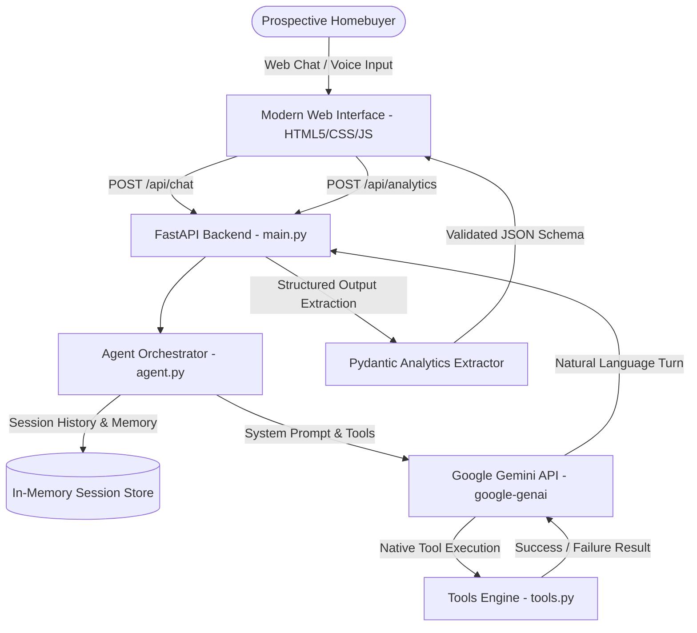

# Northstar One — AI Real Estate Conversational Sales Agent

> **Northstar Sales Agent**  
> **Author**: Utkarsh  
> **Backend**: FastAPI (Python)  
> **LLM Engine**: Google Gemini (`google-genai` SDK / Gemini 2.5 Flash)

---

## 🌟 Executive Overview

This project is an AI Sales Representative built for **Northstar Homes** to represent their flagship luxury residential project: **Northstar One** located in **Sector 79, Gurugram**.

The agent is engineered from the ground up for **dual-channel suitability** (working across both **conversational voice/calling** and **text web chat**). It qualifies incoming leads, handles complex customer objections, dynamically mirrors languages and dialects (**English, Hindi, and Hinglish**), natively executes backend actions via **Gemini Function Calling** (simulating site-visit bookings with realistic constraint validation and failure handling), and extracts **Structured CRM Intelligence & Analytics** post-conversation using Pydantic schemas.

---

## 🏗️ System Architecture



---

## 🚀 Key Features

### 1. Dual-Channel Prompting (Voice & Chat Adaptability)
- **Spoken Cadence & Pacing**: Enforces concise, 1–3 sentence responses per turn to prevent long, robotic monologues during telephony or voice calls.
- **TTS-Friendly Syntax**: Avoids heavy markdown formatting, large nested tables, and bullet point walls in conversational spoken turns.
- **Natural Currency Pronunciation**: Speaks numbers naturally in Indian denominations (*"one point three five crore rupees"* or *"₹1.35 Cr"*).

### 2. Strict Anti-Hallucination Guardrail & Knowledge Boundary
- **Fixed Pricing**: 2 BHK starting at **₹1.35 Crore**, 3 BHK starting at **₹1.75 Crore**.
- **Fixed Location**: Sector 79, Gurugram (scenic Aravalli foothills, NH-48 & SPR connectivity).
- **Strict Boundary**: Positively prohibits hallucinating unverified discount percentages, fake floor plans, possession dates, or unannounced 4/5 BHK configurations. Unknown inquiries trigger transparent escalation to human property specialists.

### 3. Dynamic Multilingual & Dialect Mirroring
- Auto-detects the customer's language and mirrors their exact dialect:
  - **English**: Professional, courteous, consultative.
  - **Hindi**: Respectful, fluent, and warm (*"नमस्ते! नॉर्थस्टार वन में आपका स्वागत है..."*).
  - **Hinglish**: Natural contemporary conversational tone (*"Hello sir! Bilkul, Sector 79 Gurugram mein 2 BHK ₹1.35 Cr se start hota hai..."*).

### 4. Native Function Calling & Business Logic Simulation
- Connects to backend function `book_site_visit(date, time, customer_name, customer_phone, configuration)`.
- **Realistic Business Constraint**: Site visits are conducted strictly between **10:00 AM and 6:00 PM** for safe daylight viewings.
- **Simulated Failure Handling**: If a customer requests an after-hours slot (e.g., 8:30 PM), the tool returns a structured failure (`{"status": "failure", "reason": "Site closed after 6:00 PM"}`). Gemini natively reads this failure and gracefully guides the customer toward alternate daytime slots (11:00 AM, 2:00 PM, 4:30 PM).

### 5. Automated Structured CRM Analytics
- At the conclusion of the conversation, Gemini analyzes the complete dialogue transcript against a Pydantic `LeadAnalytics` schema using `response_schema`.
- Guarantees valid, typed JSON output covering:
  - `budget_range`
  - `interest_level` (`High`, `Medium`, `Low`, `Uninterested`, `DND_Requested`)
  - `configuration_preference` (`2 BHK`, `3 BHK`, `Both`, `Undecided`, `Out of Scope`)
  - `site_visit_status` (`Booked`, `Failed_Attempt`, `Rescheduled`, `Not_Requested`, `Declined`)
  - `follow_up_requirement` (`Immediate Callback`, `Scheduled Callback`, `Send Brochure`, `None (DND)`)
  - `customer_sentiment`
  - `objections_raised`
  - `executive_summary`
  - `recommended_next_action`

---

## 📂 Project Structure

```text
├── backend/
│   ├── __init__.py            # Backend package initialization & re-exports
│   ├── main.py                # FastAPI server, REST routes, template & static mounts
│   ├── agent.py               # Gemini client, session memory, tool calling & analytics extraction
│   ├── tools.py               # Backend tool functions (site visit booking & failure simulation)
│   └── prompts/
│       ├── __init__.py
│       └── system_prompt.py   # Dual-channel system prompt definition
├── main.py                    # Root entry point delegating to backend.main:app
├── test_server.py             # Unit test suite for API endpoints and booking tools
├── test_scenarios.py          # Automated test suite executing 9 evaluation scenarios
├── requirements.txt           # Python dependencies
├── .env.example               # Environment variable template
├── PROMPT.md                  # Detailed prompt engineering documentation
├── README.md                  # Project documentation and architectural guide
├── templates/
│   └── index.html             # Modern web interface (Chat + CRM Intelligence panel)
└── static/
    ├── style.css              # Clean, responsive luxury styling
    └── app.js                 # Client logic (STT, TTS, chat streaming, tool rendering, analytics)
```

---

## 🛠️ Installation & Quickstart

### Prerequisites
- Python 3.10+
- Google AI Studio API Key ([Get a free key here](https://aistudio.google.com/))

### Step 1: Clone Repository & Setup Virtual Environment
```bash
git clone https://github.com/Utkarshxtripathi/North-Star-sales-agent.git
cd North-Star-sales-agent

# Create virtual environment
python -m venv venv

# Activate virtual environment
# Windows:
venv\Scripts\activate
# macOS/Linux:
source venv/bin/activate
```

### Step 2: Install Dependencies
```bash
pip install -r requirements.txt
```

### Step 3: Configure Environment Variables
Create a `.env` file in the root directory:
```env
GEMINI_API_KEY="your_actual_gemini_api_key_here"
GEMINI_MODEL="gemini-2.5-flash"
PORT=8000
HOST="127.0.0.1"
```

### Step 4: Run the Application
```bash
python main.py
# Or run with uvicorn directly:
# uvicorn main:app --reload --port 8000
```
Open your browser and navigate to: **`http://localhost:8000`**

---

## 🧪 Automated Test Suite & Benchmark Scenarios

Run the automated test suite to evaluate the agent across 9 critical business scenarios:
```bash
python test_scenarios.py
```

### Scenarios Covered:
1. **Lead Qualification & Pricing (English)**: Accurately quotes ₹1.35 Cr (2 BHK) and ₹1.75 Cr (3 BHK) in Sector 79.
2. **Hindi Dialect Mirroring**: Respectful, fluent Hindi conversation.
3. **Hinglish Dialect Mirroring**: Natural contemporary Hinglish communication.
4. **Handling Price Objections**: Counter-framing with Sector 79 growth, Aravalli views, and luxury specs.
5. **Site Visit Booking Success**: Books slot at 3:00 PM and generates confirmed Booking ID.
6. **Site Visit Booking Failure Handling**: Rejects after-hours request (8:30 PM) and suggests daytime slots (10 AM - 6 PM).
7. **Busy Customer & Scheduled Callback**: Empathetically logs callback time when customer is driving/busy.
8. **DND / Stop Communication**: Zero pushiness, confirms opt-out and ends conversation politely.
9. **Anti-Hallucination & Out-of-Scope**: Blocks requests for fake 5 BHK penthouses or unlisted 25% discounts.

---

## 📌 Key Assumptions

1. **Inventory Availability**: For the scope of this assignment, 2 BHK and 3 BHK units are assumed available for booking tours during operational hours.
2. **Visiting Hours**: Northstar One Experience Centre operating hours are 10:00 AM to 6:00 PM, 7 days a week.
3. **In-Memory State**: Session chat history is maintained in an in-memory dictionary. In a production enterprise deployment, this would be backed by Redis or PostgreSQL.
4. **Voice Interaction**: The web interface leverages the standard Web Speech Synthesis & Recognition APIs to demonstrate dual voice readiness on any modern browser.

---

## ⚠️ Known Limitations

1. **Live Telephony Stream**: Real-time SIP/Twilio bidirectional audio streaming requires a telephony bridge (e.g. LiveKit / Twilio Media Streams); the current implementation demonstrates voice-readiness via browser Web Speech and spoken-first prompt design.
2. **Ephemeral Memory**: In-memory sessions reset upon server restart.
3. **Calendar Integration**: Site visit bookings are simulated within `tools.py` rather than syncing to Google Calendar or Salesforce CRM.

---

## 🤖 AI Tools Used

- **Google Gemini 2.5 Flash / `google-genai` SDK**: Core language model, native function calling orchestration, and Pydantic structured output generation.
- **Antigravity AI Assistant**: Pair-programming, test scenario structuring, and UI implementation.
